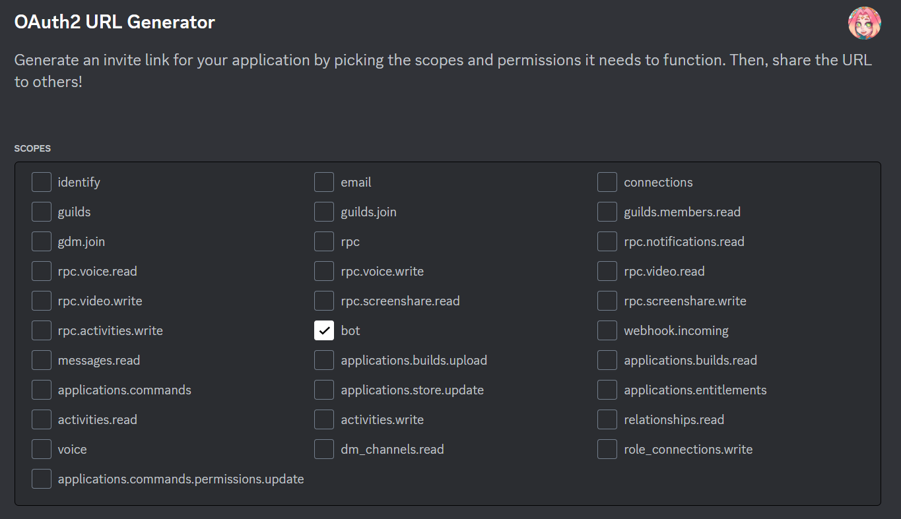
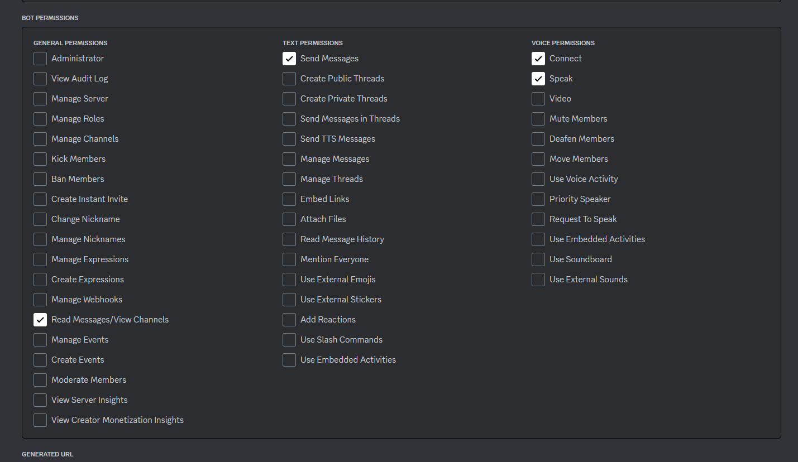

## Discord Radio StkngEsk

This bot is intended to be used on a single voice channel and an unique discord server.

**How to use:**

Install TypeScript globally `npm i -g typescript` to use `tsc` inside start command to build the dist folder.

Create a `config.json` with your custom discord bot token and desired transmission gap

1. `npm install`
2. `npm run start`

Discord bot permissions:
```typescript
    GatewayIntentBits.Guilds, // Channels permissions
    GatewayIntentBits.GuildMessages, // Send channel messages
    GatewayIntentBits.GuildVoiceStates, // Voice channel permissions (Connect/Speak)
    GatewayIntentBits.MessageContent // Read messages/View Channels
```



Then after joined the discord bot to your server, you can join to a voice channel and send the message `prendelo` in a text channel
where the bot is, then bot will join to the voice channel

How to play music:

say on a text channel while you are in a voice channel: `prendelo`
say on a text channel: `pon {yt/spotify/soundcloud url}`

How to loop song list:

say on a text channel: `loopit`